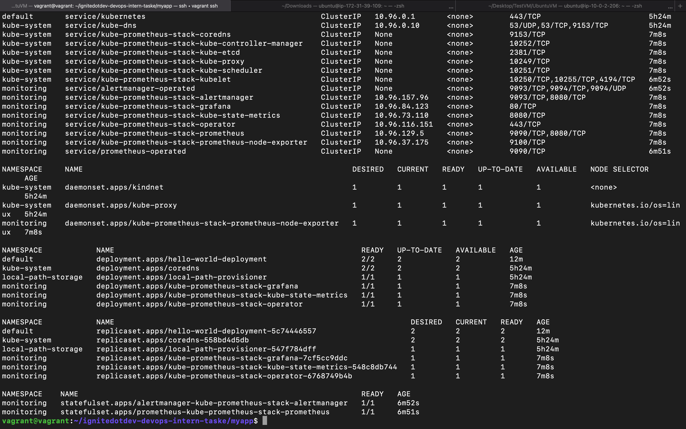

# ignitedotdev-devops-intern-tasks

## Task One (Creation of a K8s Cluster with kind)
*** The environment this task was carried on was Linux Ubuntu***

To create the the k8s cluster run the ```kind-script.sh``` file using this command

```sudo sh kind-script.sh```

To download the kubeconfig of the created cluster and also save its content to a file, run this command.

```kind get kubeconfig --name kind > KUBECONFIG```

## Task Two

To create an image of the Sample express app, run this command to create the docker image.

```docker build . -t docker-hub-username/hello-world-app```

In order to deploy the created image to Dockerhub, ensure you have a [DockerHub](https://hub.docker.com/signup) repo account.

Before you login into your docker repo, generate an Access Token which will be used to login into your account.

```docker login -u docker-hub-username```

Push image to DockerHub

```docker push achebeh/hello-world-app```

With the image pushed to Dockerhub, you can now deploy the k8s deployment to the kind cluster using terraform using the following commans.

Initiliazing Terraform resources

```terraform init```

To see the resources to be created

```terraform plan```

To finally deploy

```terraform apply --auto-approve```

Th above terraform commands will also deploy  ```kube-prometheus stack```, using the ```terraform helm provider```

Below are the screenshots of the created resources.

 

 


